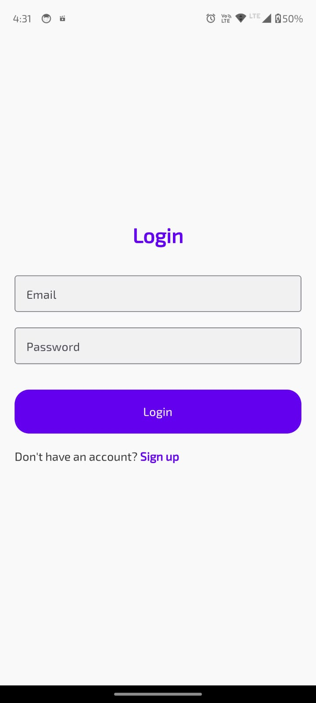
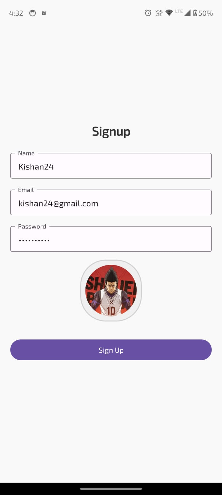
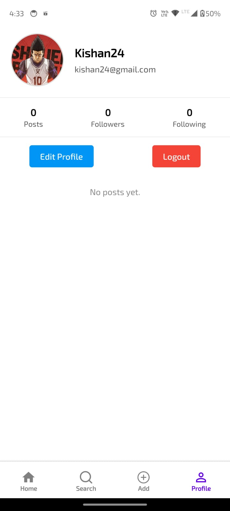
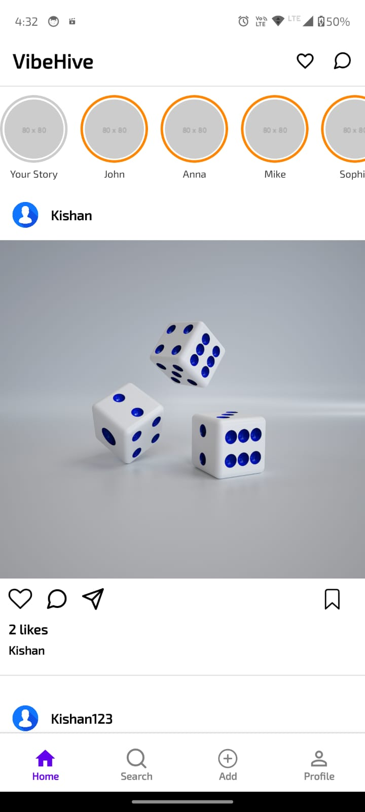
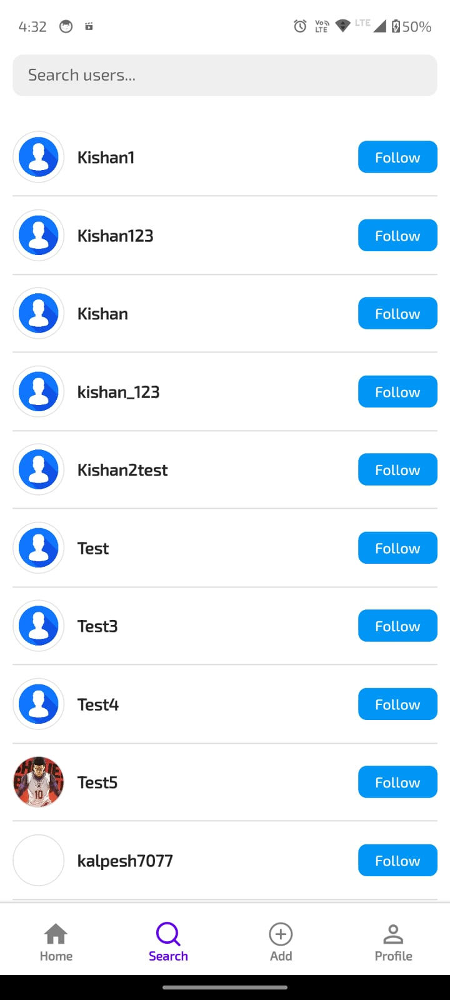
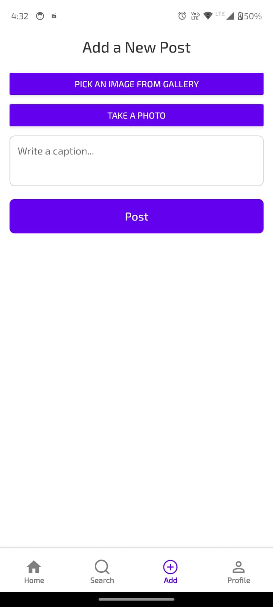
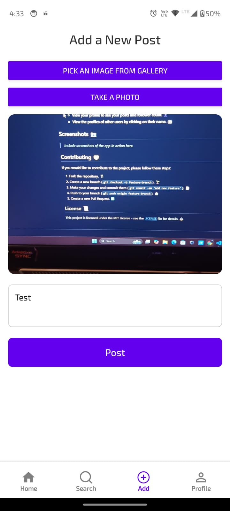
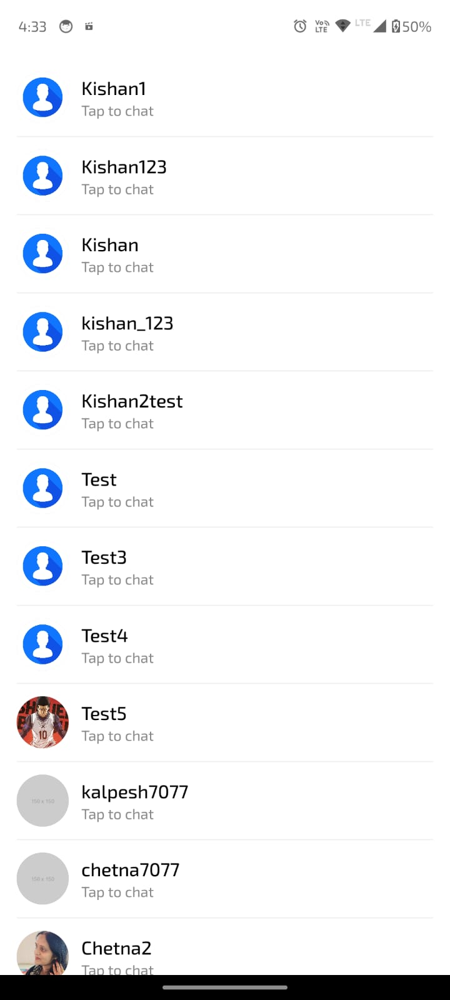
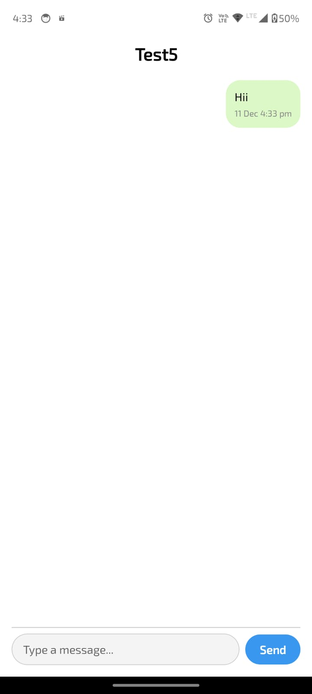
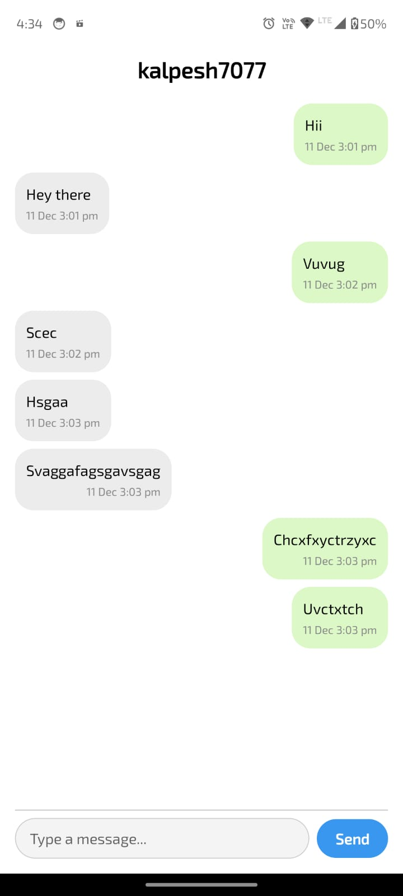

# VibeHive - Social Media App 🚀

VibeHive is a social media app that allows users to connect with others, share content, and interact in real-time. It includes features like logging in, signing up with email verification, uploading posts and images, following users, chatting in real-time, and more. 🌟

## Features

- **User Authentication 🔑**: 
  - **Login**: Users can log in to the app using their credentials. 🔐
  - **Signup**: Users can create an account and receive email verification to confirm their email address. 📧
  - **Logout**: Users can log out from the app. 👋
  
- **Post Creation 📝**: 
  - Users can upload posts and images to share with their followers. 📸
  - **Add Comments 💬**: Users can comment on posts shared by other users.

- **Social Features 🌍**:
  - **Like Posts ❤️**: Users can like posts shared by others.
  - **Follow Users 👥**: Users can follow other users to stay updated on their posts.
  - **Profile Screen 📱**: Displays user profile with uploaded posts, follower count, and following count.
  
- **Real-Time Chat 💬**: Users can chat in real-time with other users, enabling seamless communication. 🗨️
  
- **User Search 🔍**: Allows users to search for other users to follow or interact with.

- **Photo Sharing 📷**: Users can upload and share photos on their profiles or in comments. 📲
  
## Technologies Used 💻

- **Frontend 🖥️**:
  - **React Native**: Framework for building the app's user interface. 📱
  - **Expo**: Development framework for React Native to build and deploy the app. ⚡
  - **Formik**: A library for building forms in React. 📝
  - **Yup**: Schema validation library for Formik to ensure proper data handling and validation. ✅

- **Backend 🔧**:
  - **Node.js**: JavaScript runtime used for the backend development. 🚀
  - **Express**: Web framework for Node.js to handle routing and server-side logic. 🌐
  - **MongoDB**: NoSQL database for storing user data, posts, comments, and other application data. 🗄️
  - **Cloudinary**: Cloud storage service used to upload and manage user images, including profile pictures and post images. ☁️
  - **Nodemailer**: Email sending library used to send email verification links to users during the signup process. 📬

## Installation ⚙️

### Prerequisites

Before you begin, ensure that you have the following installed:

- **Node.js**: Install from [here](https://nodejs.org/).
- **Expo CLI**: Install Expo CLI globally by running: 
  ```
  npm install -g expo-cli
  ```
- **MongoDB**: Install MongoDB and set up a local or cloud instance. You can use [MongoDB Atlas](https://www.mongodb.com/cloud/atlas) for a cloud database.

### Frontend Installation

1. Clone the repository:
   ```
   git clone https://github.com/yourusername/VibeHive.git
   ```

2. Navigate to the frontend directory:
   ```
   cd VibeHive
   ```

3. Install the necessary dependencies:
   ```
   npm install
   ```

4. Start the Expo development server:
   ```
   expo start
   ```

5. Scan the QR code using the Expo Go app to view the app on your mobile device.

### Backend Installation

1. Navigate to the backend directory:
   ```
   cd VibeHive-backend
   ```

2. Install the necessary dependencies:
   ```
   npm install
   ```

3. Create a `.env` file to store your environment variables (e.g., MongoDB URI, Cloudinary credentials, Nodemailer settings). Example `.env` file:
   ```
   MONGO_URI=your_mongodb_connection_string
   CLOUDINARY_CLOUD_NAME=your_cloudinary_cloud_name
   CLOUDINARY_API_KEY=your_cloudinary_api_key
   CLOUDINARY_API_SECRET=your_cloudinary_api_secret
   NODEMAILER_EMAIL=your_email@example.com
   NODEMAILER_PASSWORD=your_email_password
   ```

4. Start the server:
   ```
   npm run dev
   ```

   This will start the Express server on the default port (usually `http://localhost:5000`).

## API Endpoints 📡

The backend includes the following key routes:

- **POST /api/auth/signup**: Registers a new user and sends an email verification link. 📧
- **POST /api/auth/login**: Logs in a user and returns a JWT token for authentication. 🔑
- **POST /api/auth/logout**: Logs out the user and invalidates the JWT token. 👋
- **POST /api/posts**: Allows a logged-in user to create a new post with an image. 📸
- **GET /api/posts**: Retrieves all posts from followed users. 📰
- **POST /api/like/:postId**: Likes a specific post. ❤️
- **POST /api/follow/:userId**: Allows a user to follow another user. 👥
- **POST /api/chat**: Send a chat message between users (real-time). 💬
- **GET /api/users/search**: Search for users by name or username. 🔍
- **GET /api/profile**: Get the profile details of the logged-in user, including their posts and followers count. 👤

## Usage 🏃

1. **User Signup and Login**:
   - Sign up with a new email and password, then verify your email using the verification link sent to your email. 📧
   - After verification, log in with your credentials. 🔐

2. **Posting and Interacting**:
   - Upload photos and posts to your profile. 📸
   - Like and comment on posts shared by other users. 👍💬
   - Follow users to stay updated with their posts. 👥

3. **Real-Time Chat**:
   - Use the real-time chat feature to send messages to other users directly. 💬

4. **Profile**:
   - View your profile to see your posts and follower count. 👤
   - View the profiles of other users by clicking on their name. 👀

## Screenshots 📸

### 🛋 Login Screen  
<div align="center">

</div>

---

### 📝 Signup Screen 
<div align="center">

</div>

---

### 👤 Profile Screen  
<div align="center">

</div>

---

### 🏠 Home Feed  
<div align="center">

</div>

---

### 🔍 Search Screen  
<div align="center">

</div>

---

### ➕ Add Screen  
<div align="center">
  

</div>

---

### 💬 Chat Room  
<div align="center">

</div>

---

### 🛹 One-on-One Chat  
<div align="center">
  

</div>

---


## Contributing 🤝

If you would like to contribute to the project, please follow these steps:

1. Fork the repository. 🍴
2. Create a new branch (`git checkout -b feature-branch`). 🌱
3. Make your changes and commit them (`git commit -am 'Add new feature'`). 📝
4. Push to your branch (`git push origin feature-branch`). 📤
5. Create a new Pull Request. 🔀

